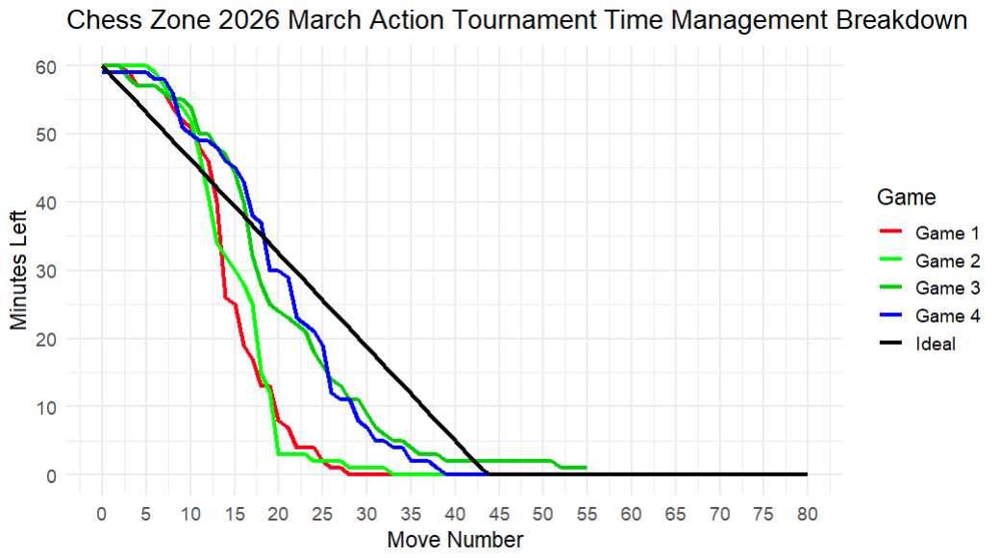
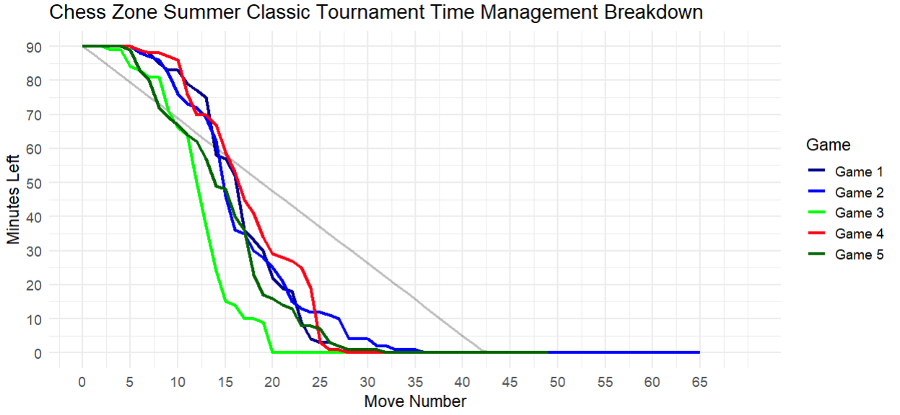
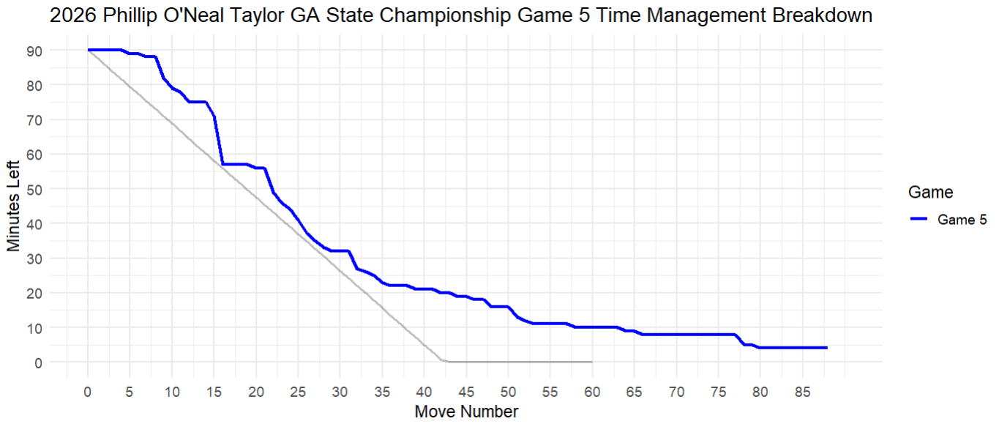

# Chess Time Management Graphs

**A personal R/ggplot2 project tracking clock usage across over-the-board chess tournament games, visualizing how time is spent move-by-move and comparing it against an ideal pace line.**



## What This Is

Every tournament game I play, I record how much time I have left on the clock at each move. This repo turns that raw clock data into line charts using R and ggplot2, overlaying each game against a calculated ideal time usage line for that tournament's time control. The result is a visual record of where I'm spending time well, where I'm burning the clock unnecessarily, and how my pacing compares across games and tournaments.

The repo is organized by year and season and grows as I play. For each tournament, I create its own R script containing all games from that event.

## Sample Output

| All Games Overlay | Single Game View |
|---|---|
|  |  |

The grey diagonal line on each chart is the **ideal pace line**, a calculated benchmark based on the tournament's time control showing what perfectly even time distribution would look like. Lines that drop steeply above the ideal indicate games where time was spent heavily in the early/middle game; lines tracking close to or below the ideal indicate more even pacing.

## How It Works

Each tournament script follows the same structure:

- **Ideal line** — calculated from the time control (starting minutes, expected game length) as a linear benchmark from full time to zero.
- **`add_game()` helper** — a reusable function that takes a vector of clock readings (one per move) and returns a tidy data frame ready for plotting.
- **Filtering** — individual game views or full tournament overlays are toggled by adjusting a simple `filter()` call, with no restructuring needed.
- **ggplot2 plotting** — each game is rendered as a colored line overlaid on the ideal, with labeled axes, a legend, and `theme_minimal()` styling.

Time controls vary by tournament, so the ideal line is recalculated per script to match the actual conditions of each event.

## Repository Structure

```
Chess-Time-Management/
├── 2026/
│   ├── Winter/
│   │   └── Chess_Zone_2026_March_Action.R
│   └── Spring/
│       └── 2026_Phillip_Taylor_GA_Champ.R
        └── ...
├── assets/               # Sample graph images for this README
├── LICENSE
└── README.md
```

New seasons are added to the current year's folder as they're played. A new year folder is created at the start of each calendar year.

## Requirements

```r
install.packages(c("ggplot2", "dplyr"))
```

## Author

**Christopher Harris** — [GitHub](https://github.com/Chris83848) · [LinkedIn](https://www.linkedin.com/in/christopher-harris9/)